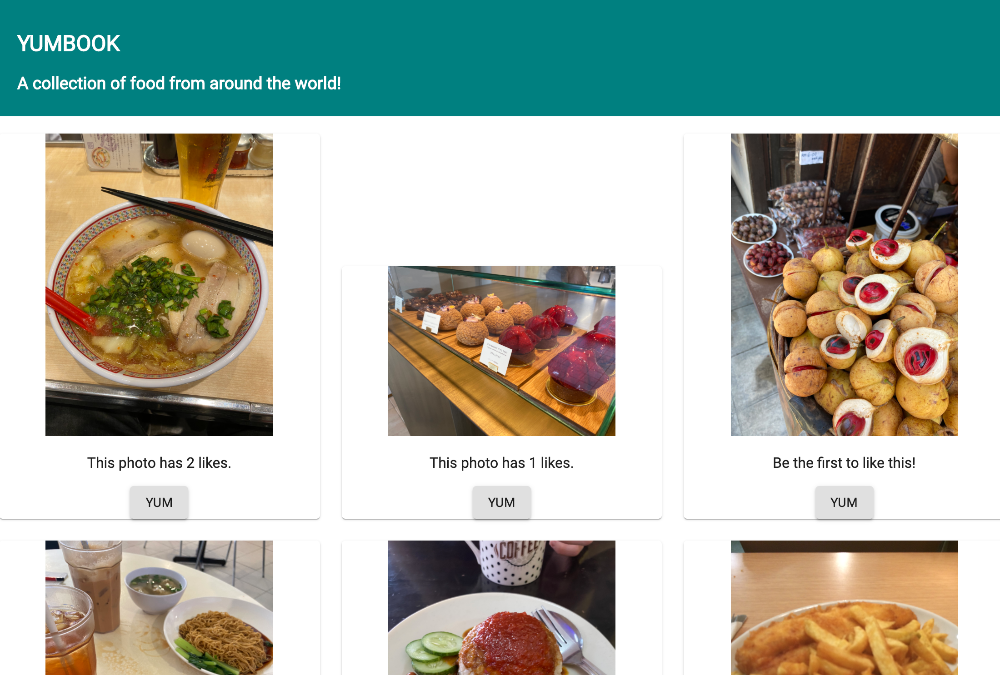
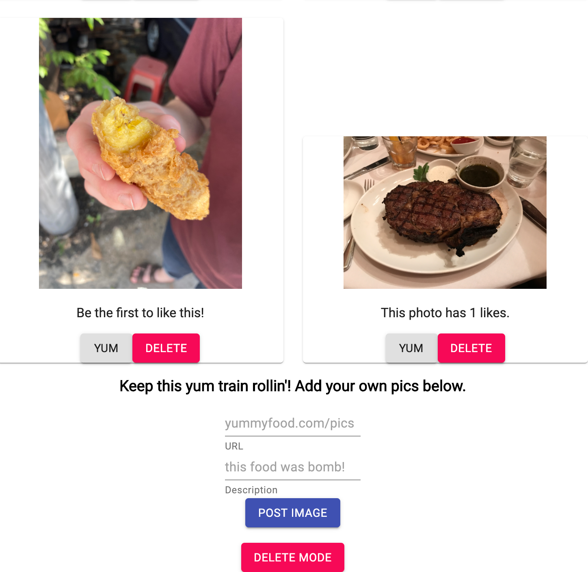

# YUMBOOK
## Description

Ever wished Facebook wasn't bogged down with all of those unnecessary features? Or tired of seeing your friends from high school getting married?  Or your aunt posting about her Mary Kay products?  

Enter Yumbook - the social media app designed around what people REALLY want to see.  Food.  Post photos and rack up 'yums'.  The more you have, the more popular you are.  No, really.

"Felt delicious - might delete later."? You can enter "Delete Mode" and delete any photos you don't want anymore.  Be warned though - those likes are gone for good.

## Screen Shots

## Built With

- Javascript
- React.js
- node.js
- express
- PostgreSQL

## Acknowledgement

Thanks to all the cool beans in the Rabin cohort at Prime!

## Developer's Notes

Mad respect to the Material-UI mavens of the world.  Buildng a nice looking webpage is tough!

## Support

If you have issues or suggestions, please email me at [dewitt.kane@gmail.com].
